<a href="https://www.noahsegonds.fr/">
  
</a>

<p align="center">
  <a href="#about"></a>
  <a href="#projects"></a>
  <a href="#experience"></a>
  <a href="#skills"></a>
  <a href="#contact"></a>
</p>


<a name="about"></a>

## 💜 about.html

```ts
const noah = {
  role:       "Data Analyst — Growth Customer United @ DECATHLON (alternance)",
  ecole:      "MSc Business Analytics @ Eugenia School · Major de promo 🏆",
  aLaCroisee: ["data", "business", "tech"],
  focus:      ["BP Digital 2035 & KYC", "ML pour la recommandation sport", "Automatisation Make & n8n"],
  hackathons: "8 menés en tant que Chef de Projet — 5 victoires",
  ensuite:    "Créer ma startup ou devenir freelance ✈️ en faisant le tour du monde",
  parleMoiDe: ["Python", "SQL", "Power BI", "agents IA"],
};
```

<details>
  <summary><b>🎓 Formation, certifications & langues</b> <i>(clique pour ouvrir)</i></summary>
  <br/>

| | Formation | Période |
|---|---|---|
| 🎓 | **Eugenia School** — MSc Business Analytics · Architecte en IA · 🏆 Major de promo | 2024 – 2026 |
| 📚 | **BUT GACO** (Agen) — Management Commercial & Marketing Omnicanal | 2021 – 2024 |

| | Certification |
|---|---|
| 🚀 | **ESCP — Excellence Propulsion Program** · audit & gestion de projet RSE / digital |
| 📊 | **Dataiku** — Data Science Studio (DSS) |

🇫🇷 Français (natif) · 🇬🇧 Anglais C1 — TOEIC 860 · 🇪🇸 Espagnol B1 · 🇩🇪 Allemand A2

🥋 Judo 1er Dan · 🏐 Volley · ♟️ Échecs · 🎮 Civilization 6, Destiny 2 · ✈️ Portugal, Italie, Grèce, Thaïlande…

</details>

<a name="projects"></a>

## 🏆 projects.js — Hackathons IA

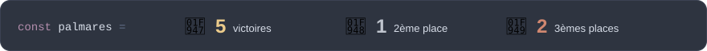

<table>
  <tr>
    <td width="50%"><a href="https://www.noahsegonds.fr/"></a></td>
    <td width="50%"><a href="https://www.noahsegonds.fr/"></a></td>
  </tr>
  <tr>
    <td width="50%"><a href="https://github.com/noahsgds/mirakl"></a></td>
    <td width="50%"><a href="https://payfit-pied.vercel.app/"></a></td>
  </tr>
</table>

<details>
  <summary><b>🔓 Voir les 4 autres hackathons</b></summary>
  <br/>
<table>
  <tr>
    <td width="50%"><a href="https://michimichi.lovable.app/"></a></td>
    <td width="50%"><a href="https://www.loom.com/share/6ddc6ae5dc204aa585975148c1657361"></a></td>
  </tr>
  <tr>
    <td width="50%"><a href="https://github.com/noahsgds/green-challenge-hub"></a></td>
    <td width="50%"><a href="https://www.noahsegonds.fr/"></a></td>
  </tr>
</table>
</details>

<details>
  <summary><b>🛠️ Side projects sur GitHub</b></summary>
  <br/>

| Projet | Ce que ça fait | Stack |
|---|---|---|
| 🔎 [VectorLens](https://github.com/noahsgds/journaux) | Plateforme RAG : recherche sémantique dans des archives de journaux, réponses IA sourcées | Next.js · Supabase pgvector · Claude |
| 📚 [Books Scraper](https://github.com/noahsgds/book_scrapping) | Pipeline de scraping automatisé, export CSV, monitoring Discord, planifié chaque nuit | Python · Docker · cron |
| 🎮 [LoL Mate Comparator](https://github.com/noahsgds/lol_stats) | Compare les stats de joueurs League of Legends via l'API Riot | Node.js · Vite |
| 🌴 [Jungle Gather Game](https://github.com/noahsgds/WelcomeToTheJungle) | Jeu d'onboarding pour Welcome to the Jungle avec chatbot Dust | React · TypeScript |
| 🍳 [Scraping Marmiton](https://github.com/noahsgds/scraping-marmiton) | Mon premier projet Python : recettes filtrables par ingrédients | Python · HTML |

</details>

<a name="experience"></a>

## 💼 experience.ts


<a name="skills"></a>

## ⚡ skills.json

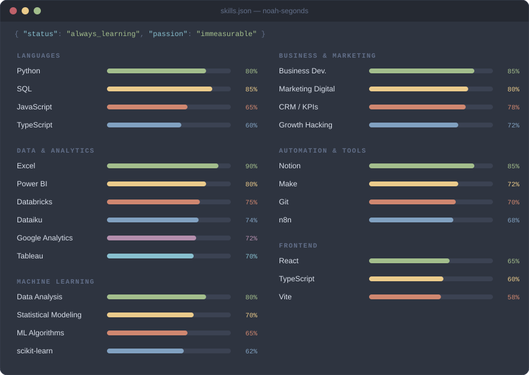

<p align="center">
  
  
  
  
  
  
  
  
  
  
</p>

## 📊 github_stats.py


<picture>
  <source media="(prefers-color-scheme: dark)" srcset="https://raw.githubusercontent.com/noahsgds/noahsgds/output/snake-dark.svg" />
  <source media="(prefers-color-scheme: light)" srcset="https://raw.githubusercontent.com/noahsgds/noahsgds/output/snake-light.svg" />
  
</picture>

<a name="contact"></a>

## ✉️ contact.css

<p align="center">
  <a href="https://www.noahsegonds.fr/"></a>
  <a href="https://www.linkedin.com/in/noah-segonds/"></a>
  <a href="mailto:noah47300@gmail.com"></a>
</p>

<p align="center">
  <code>// open to work, collabs & good conversations</code><br/><br/>
  
</p>
